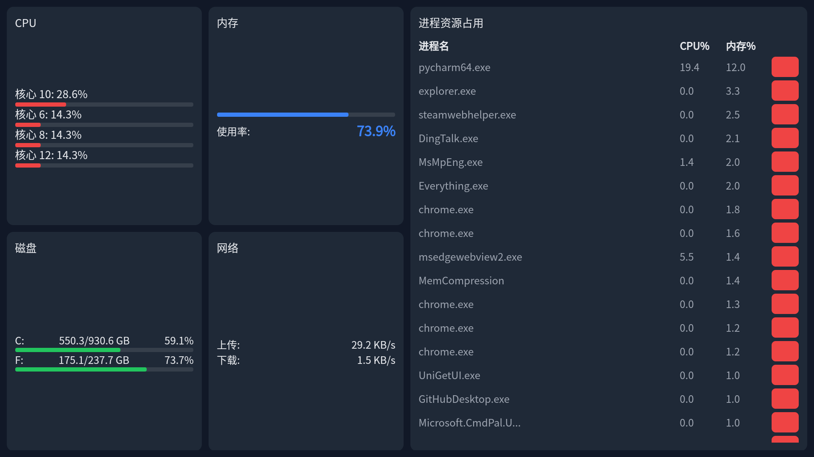

# Windows 系统监控工具

这是一个跨平台的系统监控解决方案，包含Python服务端、Web前端和Android客户端，可实时监控Windows系统性能并支持进程管理。

## 功能特点

- **实时系统监控**：
  - CPU核心使用率（展示Top 4核心）
  - 内存使用率
  - 磁盘空间（C/D/E/F盘）
  - 实时网络速度（上传/下载）
  - 进程资源占用（Top 10内存占用）
- **进程管理**：
  - 支持远程结束进程
- **多端访问**：
  - 浏览器访问（支持暗色/亮色主题）
  - Android客户端（全屏沉浸式体验）

## 运行环境

### 服务端
- Python 3.6+
- 依赖库：`psutil`, `flask`
- 操作系统：Windows（需管理员权限）

### Android客户端
- Android 5.0+
- 需要网络权限

## 安装与运行

### 服务端安装
```bash
# 安装依赖
pip install psutil flask

# 运行服务（管理员权限）
python main.py
```
> 注意：必须以管理员权限运行，否则无法结束进程

### Android客户端
1. 使用Android Studio导入项目
2. 修改`MainActivity.java`中的IP地址：
```java
// 修改为你的电脑IP地址
webView.loadUrl("http://192.168.2.124:5000");
```
3. 构建并安装到Android设备

## 使用说明

### 浏览器访问
- 默认监控页面：`http://<服务器IP>:5000`
- 亮色主题：`http://<服务器IP>:5000/white`
- 科技感主题：`http://<服务器IP>:5000/cool`

### Android客户端
1. 确保手机与监控电脑在同一局域网
2. 打开App自动加载监控界面
3. 全屏沉浸式体验，自动保持屏幕常亮

### 结束进程
1. 在进程列表找到目标进程
2. 点击右侧🗑️图标
3. 确认提示框即可结束进程

## 项目结构
```
.
├── main.py              # Flask服务端
├── index.html           # 默认监控页面（暗色主题）
├── white_index.html     # 亮色主题页面
├── cool.html            # 科技感主题页面
└── android/
    ├── MainActivity.java # Android客户端主界面
    └── ...              # Android项目其他文件
```

## 注意事项
1. 服务端需要管理员权限才能结束进程
2. 首次运行时防火墙可能弹出警告，需允许访问
3. Android客户端需要修改为正确的服务器IP地址
4. 结束系统关键进程可能导致系统不稳定，请谨慎操作

## 界面预览
  
*(实际截图需替换为真实图片)*

## 常见问题
**Q: 为什么无法结束进程？**  
A: 请确保以管理员权限运行服务端程序

**Q: Android客户端无法连接？**  
A: 检查：
1. 手机和电脑是否在同一网络
2. 防火墙是否允许5000端口
3. IP地址是否正确

**Q: 磁盘信息不显示？**  
A: 服务端默认监控C/D/E/F盘，如需其他分区请修改`main.py`中`target_drives`集合
